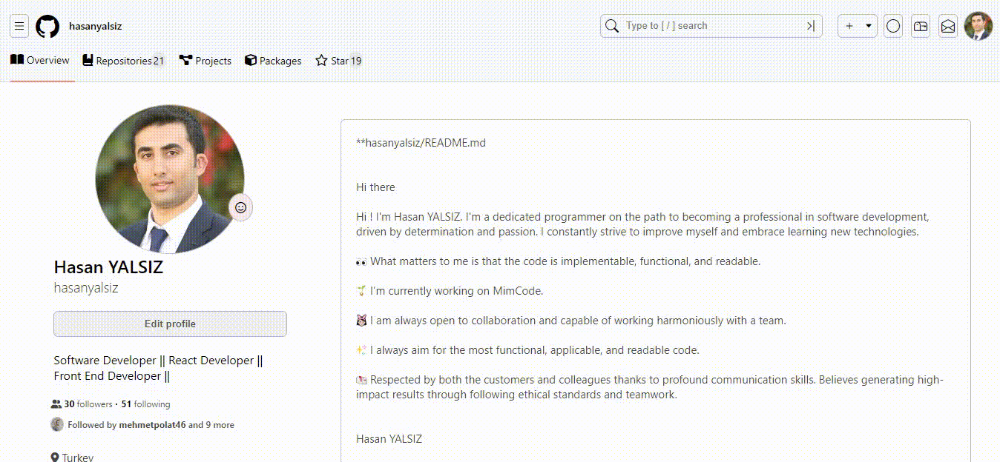

# GithubCloneProject

Bu proje, GitHub sayfasını profil bölümünün kolonlama amacıyla HTML, CSS ve SCSS kullanılarak oluşturulmuştur.

## Proje Açıklaması

Bu projede, GitHub profil sayfasını kolonlama yöntemi kullanılarak tasarlanmıştır. İlgili kodlar HTML, CSS ve SCSS dilleri kullanılarak yazılmıştır.

## Kullanım

Proje dizinindeki `index.html` dosyasını tarayıcınızda açarak sonuçları görebilirsiniz. Tarayıcı penceresi boyutunu değiştirerek, kolonlama düzeninin nasıl tepki verdiğini gözlemleyebilirsiniz.

# GithubClone
